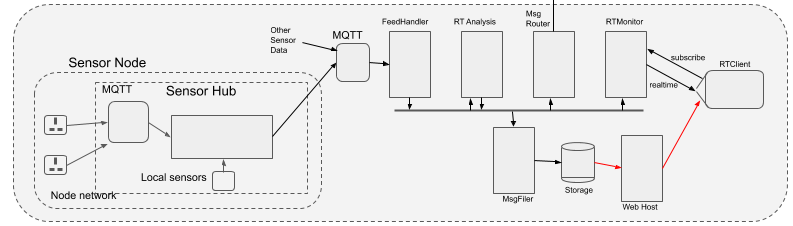

# Adaptive City Program Real-Time Server

## Overview

This system, written in Java / [Vertx](https://vertx.io) is designed to receive 'real-time' sensor data
such as detailed in-building energy use or regional vehicle position feeds. The platform supports
analysis on these updates in real-time, and provides both web-based information
pages and also sends messages to other systems based on user subscriptions.

In terms of system design, the platform is notable mainly in that:
- An asynchronous message-passing paradigm is at the core of the platform, i.e.
vehicle position data is received by the FeedHandler module in real-time, formatted as a a message,
and published in the system. Other modules will receive and process those messages, themselved publishing
derived messages such as a zone becoming congested.
- The [Vertx](https://vertx.io) library is used to provide a non-blocking framework for the server-side
Java code, with the modules themselves designed to operate asynchronously and be non-blocking.
- Each module in the system (e.g. FeedHandler, FeedPlayer, Zone, Route, Vehicle) is designed to be an
independent agent or [actor](http://www.brianstorti.com/the-actor-model/), and the system design
supports configurations of arbitrary numbers of feeds, zones, users etc.

## System Architecture Overview

The system is composed of Vertx modules (i.e. Verticles) that communicate via a clustered EventBus. Each module
is intended to represent an agent in the system. A FeedHandler can accept data via any custom means (currently http) and then
broadcast that realtime data via the EventBus, a Zone module can subscribe to these vehicle position events, generate its
own status update messages such as congestion alerts, and broadcast its own messages back onto the EventBus for other
modules to receive.

The Adaptive City Platform is *modular* and there is no particular limit on the number of modules that can be concurrently supported. A production
implementation is expected to have hundreds or thousands of verticles processing data simultaneously.

The use of Vertx and the clustered EventBus allows Rita modules to be run in multiple instances on a single server, and
also across multiple distributed servers. This also allows the realtime data to be archived simultaneously in multiple locations.

Most current modules in the Rita platform are general purpose, i.e. the function is independent of the actual type of
realtime data received. The image below shows this division between (on the left) general-purpose modules
that have no interest in the actual type of realtime data received (e.g. the FeedMaker and MsgFiler) and
(on the right) those that interpret the data and produce derived analytics.

## Summary of system modules
*For more detail see the readme in each module directory*

### FeedMaker (see [FeedMaker README](src/main/java/acp_server/feedmaker))

FeedMaker is an enhanced feedhandler that can receive POST data but also periodically GET data sources that do not themselves
provide a real-time POST 'push'-style feed. It will *poll* a website periodically, immediately store the data in the raw
format in which it was received, and parse the data and publish it as a message on the EventBus.

FeedMaker publishes feed data to the EventBus to use MsgFiler to store the json parsed data it generates.

### Console (see [Console README](src/main/java/acp_server/console))

Designed to be used by admin users, the Console presents a user webpage reporting status.
Each module in the system reports its 'up' status regularly on the Vertx eventbus, and the console
listens for these messages and dynamically adds status reporting areas to the web page. Any module can
also transmit general log messages to the console.

It is intended to add a command-line in the console, to provide convenient web-based administration of
some aspects of the system.

### MsgFiler (see [MsgFiler README](src/main/java/acp_server/msgfiler))

MsgFiler is a general-purpose module that can be configured to subscribe to messages on the 
EventBus and store them in the filesystem.

### MsgRouter (see [MsgRouter README](src/main/java/acp_server/msgrouter))

MsgRouter subscribes to messages on the EventBus and POST's them to URL destinations.

### HttpMsg (see [HttpMsg README](src/main/java/acp_server/httpmsg))

HttpMsg is a generalized Vertx module which can receive Json packets as http POST's and then
send that data as a message on the EventBus.

### FeedCSV (see [FeedCSV README](src/main/java/acp_server/feedcsv))

A FeedCSV module subscribes to a FeedHandler feed, and writes the data
as CSV (comma-delimited ascii text) files in the server filesystem.

### StaticServer (see [StaticServer README](src/main/java/acp_server/staticserver))

StaticServer is a simple HTTP server for serving static files. This is useful with the Rita verticles
running behind an Nginx reverse proxy, with /static/* requests redirected to this server.

